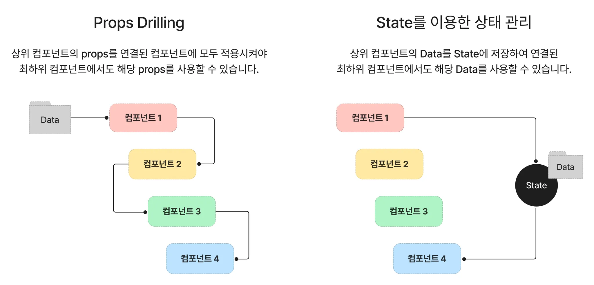

# 오류 수정

1. npm install uuid
2. Main 컴포넌트에 Button 컴포넌트 밑에
```jsx
    <main>
      <Button>레드벨벳 노래 찾기</Button>
      <Button>남자 아티스트 노래 찾기</Button>
      <Button>여자 아티스트 노래 찾기</Button>
      <KPopList />
    </main>
```
3. context.jsx

```jsx
  return (
    <KPopContext.Provider value={{data, playlist, setPlaylist}}>
      {children}
    </KPopContext.Provider>
  );
```

<KPopContextProvider value={{data, playlist, setPlaylist}}>
->
<KPopContext.Provider value={{data, playlist, setPlaylist}}>

# Hook 

## 정의

: Hook은 함수 컴포넌트에서 상태 관리와 생명주기 기능을 연동할 수 있게 해주는 함수

함수 컴포넌트는 상태를 가질 수 없고, 메서드를 사용해 생명주기를 관리하는 것도 불가능. 기존에는 코드의 복잡성과 낮은 재사용성의 문제에도 불구하고 클래스 컴포넌트를 사용해야만 했습니다. 이후에 Hook에 등장하고, 효율적인 상태 관리 및 생명주기 기능을 사용할 수 있게 되었습니다. 


### 기본 Hook vs. 추가 Hook

- 기본 Hook은 상태 관리와 생며웆기 기능을 위해 가장 많이 사용됨.
- 추가 Hook은 기본 Hook을 변경하거나 특정한 경우에 필요에 따라 사용
- Hook 라이브러리를 참고하고, 미리 유용한 기능을 파악하면 Custom Hook의 필요성 여부를 따질 수도 있고, Custom Hook 제작시에 추가도 가능

### Hook의 사용 이유
: 이상의 필기에서 함수 컴포넌트에서는 상태 관리 및 생명주기 메서드 사용이 x였기 때문에 로직의 재사용 및 구조 파악이 어렵고 코드가 복잡한 클래스 컴포넌트의 사용이 강제되었습니다. 

```jsx
//클래스 컴포넌트의 예시
class Example extends React.component {

  constructor(){
    super();
    this.state={title: "example"};

    }
    render(){
      return <p>hello, {this.state.title}</p>
    }
  }
}
```

클래스 컴포넌트는 render() 메서드를 반드시 포함해야 하고, render() 메서드 내부에 렌더링하고 싶은 jsx 코드를 작성하는 구조였습니다. 또한, props를 조회하거나 상태를 업데이트하기 위해서 this 키워드를 활용하여 this.props / this.setState를 사용해야 했습니다. 

하지만 이 후 함수 컴포넌트에서 상태 관리 및 생명주기 이벤트 사용이 가능하게 되었는데, 예시는 다음과 같습니다. 

```jsx
//함수형 컴포넌트 예시
function Example() {
  let [title, setTitle] = useState('example');
  return <p>hello, {title}</p>
}
```

### Hook 장점

1. 컴포넌트 간 상태 로직을 재사용 가능
2. 구조 이해가 클래스 컴포넌트에 비해서 간편함
3. 클래스 컴포넌트 없이 함수형 컴포넌트에서 사용 가능

#### 상태 관련 로직 재사용 가능
프로그램 작성시에 중복 코드를 수비게 만나게 될 수 있습니다. 이 때 중복된 코드로 인한 불필요한 리소스를 줄이고자 상황에 따라 코드를 재사용합니다. 

기존의 클래스 컴포넌트를 기준으로 했을 떄에는 Render props/ 고차 컴포넌트(HOC, Higher Order Component)와 같은 재사용 패턴을 사용해야만 했습니다. 

다음은 예시입니다. 

```jsx
//고차 컴포넌트를 통한 재사용
//고차 컴포넌트
function withLogin(WrapperComponent){
  return class extends React.Component {
    //생성자 및 공통 상태 로직(아까 위에서 작성한 것과 유사합니다. )
    cunstructor(){
      state={
        user:[]
      }
    }

    compnentDidMount(){
      // 비동기 작업 처리(데이터 받아오기 관련 코드)
    }
    //내부 컴포넌트 렌더링
    render(){
      return<WrapperComponent
            {...this.state} />;
    }
  };
}

//컴포넌트 재사용
function Loginpage({user}){
  //내려받은 user데이터 사용하는 로직
}

export default withLogin(LoginPage); //고차컴포넌트로 감싸주기
```
와 같은 과정을 거쳤습니다. 그런데 Hook 의 등장 이후, Custom Hook을 통해 컴포넌트 간 상태를 저장하고 고ㅓㅇ유할 수 있게 되었습니다. 즉, 고차 컴포넌트 같ㅇ느 패턴을 사용하지 ㅇ낳고도 Hook으로 컴포넌트를 재사용

```jsx
//Custom Hook으로 컴포넌트 재사용 예시
//Custom Hook
function useLogin(){
  const[user, setUser] = useState([]);

  useEffect(()=>{
    //비동기 작업 처리(데이터 받아오기) 로직
  }, [])

  return [user];
}

//컴포넌트 재사용
function Loginpage(){
  const [user] = userLogin();
  //useLogin() 컴포넌트를 재사용하여
  //원하는 형태로 return을 구현한 사례
  return (
    <>
      {user.map(({num, email, name}, idx) => {
        <div key={num}>
          <p>{email}</p>
          <strong>{name}</strong>
        </div>
      })}
    </>
  );
}
```

#### Props Drilling vs. state



state를 사용시에 데이터가 필요한 컴포넌트에 바로 사용이 가능하다는 점에서도 상태를 이용한 Hook의 장점이 많이 부각되었습니다. 

여태까지의 수업을 통해 useState / useEffect / useContext 를 작성했습니다. 
그래서 금일 추가 Hook에 해당하는 useReducer에 대한 개념을 학습합니다. 

# useReducer

: React에서 상태를 관리하는 '내장 Hook'으로, useState보다 복잡한 상태 로직을 다룰 때 유용한 기능.
특히 여러개ㅔ의 관련 상태를 다루거나, 상태 변경 로직이 복잡한 경우에 더 적합함.

## useReducer 사용 이유
- 여러 개의 상태가 서로 관련이 있거나, 복잡한 업데이트 로직의 필요시
- 액션 기반 업데이트: 상태 업데이트를 '액션'을 통해 수행, 명확하고 예측 가능한 방식으로 상태 변경을 관리 가능
- 코드 가독성 향상 : 상태 변경 로직을 reducer 함수 안에 모아두기 때문에, 컴포넌트  내부의 코드가 깔끔해짐.
- redux 와 유사한 패턴: useReducer는 Redux의  reducer 패턴과 유사하기 때문에 Redux 개념을 배우기 이전에 연습하기에도 좀 적절합니다. 

## useReducer의 기본 구조
```jsx
const [state, dispatch] = useReducer(reducer, initialState);
```

- reducer : 상태를 업데이트 하는 함수(순수 함수, 이하의 링크 참조)

- initialState: 초기 '상태' 값
- state : 현재 상태 값
- dispatch : 액션을 발생시키는 함수


